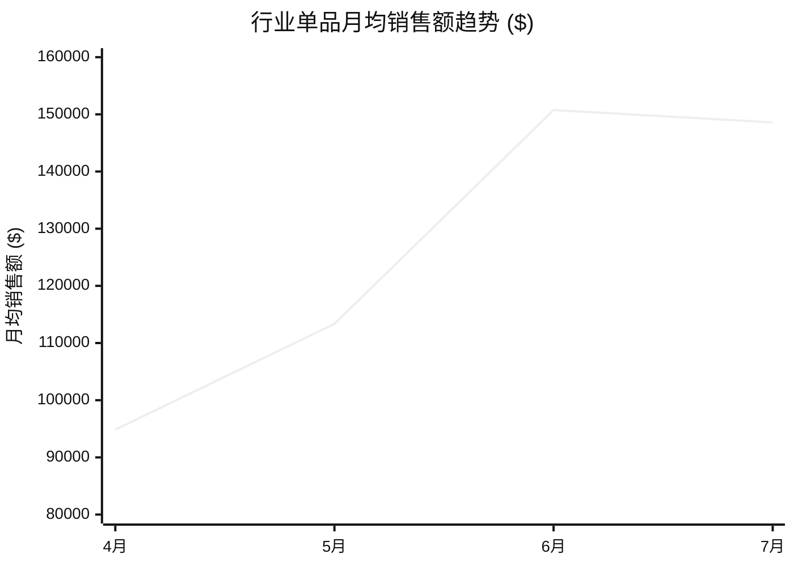

# 12 章破坏性契约选品决策报告模板 (Report Template)

所有阶段三输出的最终决策报告必须严格按照以下 12 章规范生成（包含 Mermaid 图表与清晰量化依据）：

---

# 【选品决策报告】[品类名称] [站点] 亚马逊深度市场调研

## 1. 第一章 · 核心决策结论 (执行摘要先行)
- **终局决策**：`【强烈推荐进入 / 谨慎观察 / 坚决放弃】`
- **核心评分雷达**：
  - 市场需求吸引力：[X/10] | 竞争可进入性：[X/10] | 产品差异化空间：[X/10]
  - 盈利与退货安全性：[X/10] | 获客可行性：[X/10] | **综合加权评分：[X.X/10]**
- **三条核心论据与破局策略**：
  1. [需求端依据]
  2. [标杆竞品执行漏洞 / 差异化机会]
  3. [中间结构性价格空档]

## 2. 第二章 · 调研范围与数据质量自检
- 类目节点：`[nodeIdPath]` | 样本口径：Top100 商品样本
- 深挖 ASIN：[ASIN A (走量款)]、[ASIN B (高客单款)]
- **数据缺口与进入前补验清单**：[诚实列出未成功获取的指标，如退货率或部分长尾词]

## 3. 第三章 · 行业销售大盘与趋势
- 近 4~12 个月月均销量与销售额演化（均价上移/下移趋势）：

## 4. 第四章 · 需求端与关键词证据
- 核心大词搜索量、年同比增速、购买率、供需比与 PPC 竞价区间表。
- 高增速细分赛道词（如无线/特定材质）与耗材第二流量池。

## 5. 第五章 · 细分市场现状与价格带分布
- 主力走量区间 ($XX-$XX) vs 高端高坪效区间 ($XX+) 占比。
- 中间价格带是否存在结构性真空。

## 6. 第六章 · 竞争格局与品牌集中度
- CR3 / CR10 品牌份额，头部垄断程度判断。
- Amazon 自营占比 vs 卖家属地结构。

## 7. 第七章 · 对标深挖 A：走量王爆品解剖 ([ASIN])
- 基本盘与生命周期销售走势。
- 流量结构（自然排名大词 vs 广告词分布）。
- 成功要素与隐性短板。

## 8. 第八章 · 对标深挖 B：高客单/智能款标杆解剖 ([ASIN])
- 高客单放量逻辑与月销破万验证。
- **真实差评 (1~3星) 痛点清单**：[易坏部位、APP强制订阅、材质廉价感等]。
- 结论：**用户需求已被验证，但竞品执行存在明显漏洞可被超越**。

## 9. 第九章 · 跨标杆 VOC 汇总与未满足诉求
- 买家需求层级金字塔（基本卫生 > 监测功能 > 静音 > 可靠性）。
- 对手差评与我方产品改良路线图（Defect-to-Roadmap 对照表）。

## 10. 第十章 · 进入策略与产品定义建议
- **推荐产品形态**：[全不锈钢 + 免订阅 App + 分体无泵静音设计]。
- **目标定价**：$XX.99（卡在走量王与高端款之间的空白区）。
- **流量打法**：主攻高购买率材质词与高增速长尾词，避开大词正面烧广告。

## 11. 第十一章 · 风险清单与应对方案
- 退货率预估与应对。
- 供应链可靠性与售后成本控制。
- 季节性波动的备货策略。

## 12. 第十二章 · 终局决策矩阵与进入前必验清单
- 多条细分路线综合评级（主推路线 vs 变体路线 vs 淘汰路线）。
- 进入前 4 项必须人工二次确认的核验项。